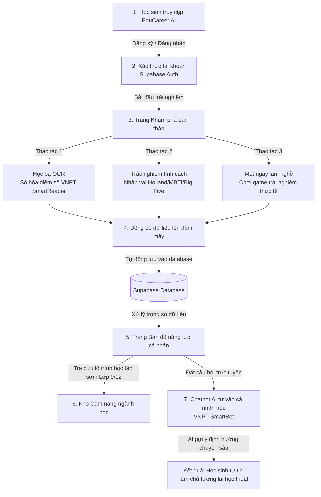

# 🎓 EduCareer AI - Hệ Thống Hướng Nghiệp Thông Minh Toàn Diện
> **Giải pháp định hướng tương lai cá nhân hóa cho học sinh THCS & THPT**
>
> *Dự án đạt chuẩn MVP tham gia Vietnamese Student HackAIthon 2026 bởi đội thi **KgLorious**.*

🌐 **Trải nghiệm trực tuyến (Live Website)**: [https://vttrongsu1.github.io/Educareer-AI/](https://vttrongsu1.github.io/Educareer-AI/)

---

## 🌟 1. Giới thiệu dự án
Hiện nay, việc chọn ngành, chọn nghề của học sinh THCS và THPT vẫn còn gặp nhiều mơ hồ, thiếu định hướng thực tế và dữ liệu khoa học. **EduCareer AI** ra đời như một hệ sinh thái hướng nghiệp thông minh toàn diện, giúp các em học sinh hiểu rõ bản thân thông qua 3 trụ cột cốt lõi: **Học thuật (Điểm số học bạ)**, **Tâm lý (Trắc nghiệm tính cách)** và **Thực chiến (Trải nghiệm nghề nghiệp thực tế)**.

Nền tảng kết hợp sức mạnh của công nghệ AI tiên tiến của **VNPT** và **Google** cùng hệ quản trị cơ sở dữ liệu thời gian thực **Supabase** để tạo nên một trải nghiệm hướng nghiệp cá nhân hóa khép kín và mượt mà.

---

## 🚀 2. Các công nghệ cốt lõi tích hợp
Dự án ứng dụng sâu các giải pháp công nghệ hiện đại nhằm giải quyết bài toán nghiệp vụ hướng nghiệp:
*   **VNPT SmartReader (OCR API)**: Tự động trích xuất bảng điểm từ ảnh chụp học bạ với độ chính xác cao trong 3 giây, giúp số hóa hồ sơ học thuật tức thì.
*   **VNPT SmartBot (AI Chatbot API)**: Đóng vai trò chuyên gia tư vấn hướng nghiệp ảo đàm thoại 1:1, tự động tích hợp profile năng lực học sinh làm ngữ cảnh (Context Payload) để đưa ra câu trả lời cá nhân hóa dạng Streaming.
*   **Google Gemini 2.5 Flash + Web Search Grounding**: Hỗ trợ Module Quản trị tự động biên soạn cẩm nang ngành học chi tiết, phân tầng lộ trình học tập sớm lớp 9 và 12 chính xác.
*   **Supabase (Auth & Database)**: Xác thực tài khoản học sinh bảo mật và đồng bộ hóa đám mây toàn bộ dữ liệu học bạ, kết quả trắc nghiệm và hành vi game.
*   **Text-to-Speech (TTS)**: Phát âm thanh tương tác sinh động trong các bài trắc nghiệm nhằm tăng tính Gamification.

---

## 🛠️ 3. Các tính năng nổi bật (MVP)
1.  **Số hóa học bạ OCR**: Tải ảnh chụp học bạ lên, tự động nhận diện điểm số và cho phép học sinh chỉnh sửa trực tiếp nếu ảnh mờ trước khi lưu.
2.  **Trắc nghiệm tính cách nhập vai**: Các bài kiểm tra khoa học **Holland, MBTI và Big Five** được thiết kế dưới dạng trò chơi cốt truyện phiêu lưu tương tác sinh động có nhạc nền và âm thanh.
3.  **Một ngày làm nghề**: Mini-game giả lập công việc thực chiến (như Lập trình viên, Nhà thiết kế đồ họa) để học sinh thử sức và đánh giá mức độ yêu thích nghề nghiệp thực tế.
4.  **Bản đồ năng lực cá nhân**: Biểu đồ mạng nhện đa chiều (Radar Chart) tổng hợp trực quan 6 nhóm chỉ số năng lực cốt lõi dựa trên điểm trọng số tích hợp.
5.  **Cẩm nang ngành học phân tầng**: Thư viện tra cứu lộ trình học tập sớm dành riêng cho học sinh lớp 9 (chọn tổ hợp môn cấp 3) và lớp 12 (chọn ngành/trường Đại học).

---

## 📊 4. Luồng hoạt động tổng quát của hệ thống (General User Flow)



---

## 💻 5. Hướng dẫn triển khai và chạy cục bộ (Local Setup)

### Yêu cầu hệ thống:
*   Trình duyệt web hiện đại (Chrome, Edge, Safari).
*   Đã cài đặt **Python 3.8** trở lên (phục vụ chạy Backend FastAPI).

### Các bước cài đặt:

1.  **Clone mã nguồn dự án**:
    ```bash
    git clone https://github.com/vttrongsu1/Educareer-AI.git
    cd Educareer-AI
    ```

2.  **Khởi động Frontend**:
    *   Frontend được phát triển thuần bằng HTML, CSS, JavaScript (Vanilla JS).
    *   Bạn chỉ cần mở trực tiếp file `index.html` bằng trình duyệt hoặc chạy thông qua extension **Live Server** trong VS Code.

3.  **Triển khai Backend FastAPI**:
    *   Tạo và kích hoạt môi trường ảo:
        ```bash
        python -m venv venv
        # Trên Windows:
        venv\Scripts\activate
        # Trên macOS/Linux:
        source venv/bin/activate
        ```
    *   Cài đặt các thư viện dependencies:
        ```bash
        pip install -r requirements.txt
        ```
    *   Cấu hình tệp môi trường `.env`:
        Tạo file `.env` tại thư mục gốc với các thông tin API keys (VNPT OCR, VNPT SmartBot, Gemini API, Supabase credentials).
    *   Khởi chạy server backend:
        ```bash
        python career_server.py
        ```
        *Server sẽ chạy tại địa chỉ mặc định: `http://127.0.0.1:5001`*

4.  **Chạy thử nghiệm tự động (Automated Testing)**:
    *   Hệ thống cung cấp một script kiểm thử tự động toàn bộ API Endpoint của backend.
    *   Sau khi khởi chạy máy chủ backend ở Bước 3, bạn mở một terminal mới và chạy lệnh:
        ```bash
        python tests/test_endpoints.py
        ```
    *   *Script sẽ tự động kiểm tra Health check và gửi yêu cầu sinh cẩm nang hướng nghiệp tới Gemini API để phản hồi kết quả kiểm thử ngay trên màn hình.*

5.  **Thư mục lưu trữ hình ảnh học bạ chạy thử cục bộ (`test_data/`)**:
    *   Dự án có sẵn thư mục `test_data/` tại root dùng để chứa các hình ảnh học bạ chạy thử local của lập trình viên.
    *   Thư mục này **đã được cấu hình trong `.gitignore` để loại trừ khỏi Git**, đảm bảo tính bảo mật tuyệt đối cho thông tin học bạ cá nhân của học sinh khi đẩy code lên kho lưu trữ công khai.

---

## 👥 6. Đội ngũ phát triển (KgLorious)
*   **Nguyễn Nhật Long** - AI & Backend Engineer
*   **Trần Anh Khoa** - Frontend Developer & UI/UX Designer

---
*Dự án được bảo trợ kỹ thuật bởi các API thông minh từ VNPT AI và Google Gemini Pro.*
